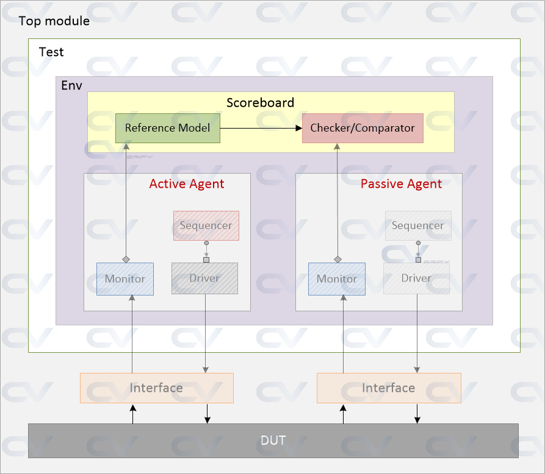
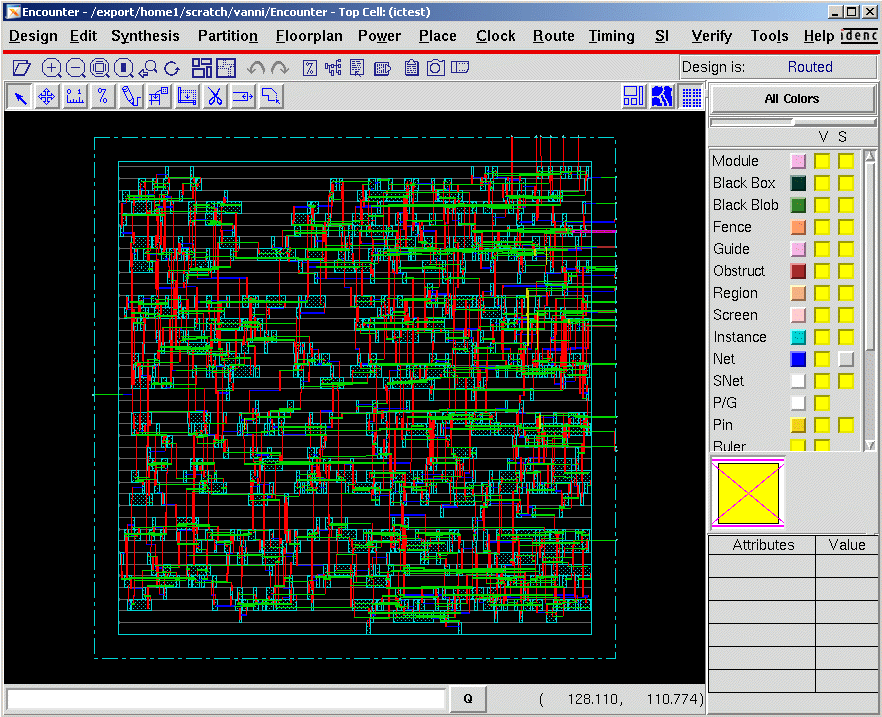

# ASIC Design Flow

## What is VLSI ?
VLSI stands for Very Large Scale Integration, which is a technology used to create integrated circuits (ICs) by combining thousands or millions of transistors into a single chip. VLSI technology has revolutionized the electronics industry by enabling the production of compact, powerful and low-cost microprocessors, memory chips, digital signal processors, and other advanced electronic devices.

As of 2020, the scale of integration in VLSI technology has reached nanometer-level processes, with feature sizes on the order of 7-5 nm, allowing for the integration of billions of transistors on a single chip. The latest processors and integrated circuits are being manufactured using 7 nm and 5 nm process nodes, enabling greater performance and power efficiency.

## What is an ASIC ?
An ASIC (Application-Specific Integrated Circuit) is a type of integrated circuit (IC) that is designed to perform a specific task or function. It is customized for a particular application, unlike general-purpose ICs such as microprocessors and memory chips.

ASICs are typically used in high-performance applications where specific processing requirements need to be met, such as in networking, telecommunications, and consumer electronics. ASICs are designed and manufactured for a specific customer or application and can include digital, analog, and mixed-signal components on a single chip.

## ASIC Design Flow
A typical design flow follows a structure shown below and can be broken down into multiple steps. Some of these phases happen in parallel and some sequentially. We'll take a look at how a typical project design cycle looks like in the industry today.


### Stage 1

1. Requirements
A customer of a semiconductor firm is typically some other company who plans to use the chip in their systems or end products. So, requirements of the customer also play an important role in deciding how the chip should be designed. Naturally, the first step would be to collect the requirements, estimate the market value of the end product, and evaluate the number of resources required to do the project.

2. Specifications
The next step would be to collect "specifications" that describe abstractly the functionality, interface and overall architecture of the chip to be designed. This can be something along the lines like :
- Requires computational power to run imaging algorithms to support virtual reality
- Requires two ARM A53 processors with coherent interconnect and should run at 600 MHz
- Requires USB 3.0, Bluetooth and PCIe 2nd gen interfaces
- Should support 1920x1080 pixel display with appropriate controller

3. Architecture
Now, the architects come up with a system level view of how the chip should operate. They will decide what all other components are required, what clock frequencies they should run, and how to target power and performance requirements. They also decide on how the data should flow inside the chip. An example would be the data flow when a processor fetches imaging data from the system ram and executes them. In the meanwhile, the graphics engine will execute post-processed data from the previous batch dumped into another part of memory and so on.


### Stage 2

1. Digital Design
Because of the complex nature of modern chips, it's not possible to build something from scratch, and in many cases, a lot of components will be reused. Say company X requires a FlexCAN module to interact with other modules in an automobile. They can either buy the FlexCAN design from another company to save time and effort or spend resources to build one on their own. Also, it's not practical to design such a system from basic building blocks like flip-flops and CMOS transistors. Instead, a behavioral description is developed to analyze the design in terms of functionality, performance and other high-level issues using a Hardware Description Language such as Verilog or VHDL. This is usually done by a digital designer and is kind of similar to a high-level computer programmer equipped with skills in digital electronics.

```
module ram_single_port
#(
    parameter ADDR_WIDTH = 16,
              DATA_WIDTH = 32
)
(
    input wire clk,
    input wire we,
    input wire [ADDR_WIDTH-1:0] addr,
    input wire [DATA_WIDTH-1:0] din,
    output wire [DATA_WIDTH-1:0] dout
);

reg [DATA_WIDTH-1:0] mem[2**ADDR_WIDTH-1:0];

always @(posedge clk) begin
    if (we == 1) // write data to address 'addr'
        mem[addr] <= din;
end

// read data from current addr
assign dout = mem[addr];

endmodule
```

2. Verification
Once the RTL design is ready, it needs to be verified for functional correctness. For example, a DSP processor is expected to issue bus transactions to fetch instructions from memory, but how do we know that this will happen as expected? So, functional verification is required at this point, which is done with the help of EDA simulators that has the capability to model the design and apply different stimulus to it. This is the job of a pre-silicon verification engineer.



To save time and reach functional closure, both the design and verification teams operate in parallel where the designers "release" an RTL version, and the verification team develops testbench environment and test cases to test the functionality of that RTL version. If any of these tests fail, then it might indicate a problem with the design and a "bug" will be raised on that design element. This bug will have to be fixed in the next version of RTL release from the design team. This process goes on until there is a good level of confidence in the functional correctness of the design.

3. Logic Synthesis
Now that we are happy with the design, it's time to convert this into hardware schematic with real elements like combinational gates and flip-flops. This step is called as synthesis. Logic synthesis tools enable the conversion of RTL description in HDL to a gate level netlist. This netlist is nothing but a description of the circuit in terms of gates and connections between them. It could look something like:

```
and_2_0     u_and2_0 ( .in_a (_net_112),
                       .in_b (_net_56),
                       .out  (_net_222));

ff_lt       u_ff_lt_122 (.d   (_net_222),
                         .clk (_net_11),
                         .q   (_net_76));
```
Logic synthesis tools ensure that the netlist meets timing, area and power specifications. Typically they have access to different technology node processes and libraries of digital elements and can make intelligent calculations to meet all these different criteria. These libraries are obtained from semiconductor fabs that provide data characteristics for different components like rise/fall times for flip-flops, input-output time for combinational gates, etc.

4. Logic Equivalence
The gate level netlist is then checked for logical equivalence with the RTL, and sometimes a "gate level verification" is performed where verification of certain elements are done once again, the difference being that this time it's at gate level and is at a lower level of abstraction. Simulation times tend to be slower because of the huge number of elements involved in the design at this stage along with back annotated delay information.

5. Placement and Routing
The netlist is then inputted to the physical design flow, where automatic place and route (APR or PnR) is done with the help of EDA tools. A good example of such tools is Cadence Encounter and Synopsys IC Compiler. This will select and place standard cells into rows, define ball maps for input-output, create different metal layers, and place buffers to meet timing. Once this process is done, a layout is generated and usually sent for fabrication. This stage is usually handled by the physical design team who are well versed with the technology node and physical implementation details.


### Stage 3
#### Validation
It doesn't end here. A sample chip will be fabricated either by the same semiconductor firm or sent to a third-party foundry like TSMC or Global Foundries. This sample now goes through post-silicon validation process where another team of engineers runs different patterns on a tester. It's a lot more difficult to debug in post-silicon validation than pre-silicon verification simply because the level of visibility into the internal nodes of a chip is drastically reduced. Moreover, a million clock cycles would have finished in a second and tracing back to the exact time of error will be time-consuming. If there are any real issues or design bugs found at this stage, then this will have to be fixed in RTL, re-verified and all the steps that follow this will have to be performed.


Even though there are multiple steps in the design flow, a lot of the design activity is usually concentrated on the optimization and verification of RTL description of the circuit. It's important to note that although EDA tools are available to automate the processes, improper usage will lead to inefficient designs and hence a designer has to make conscious choices during the design process.

