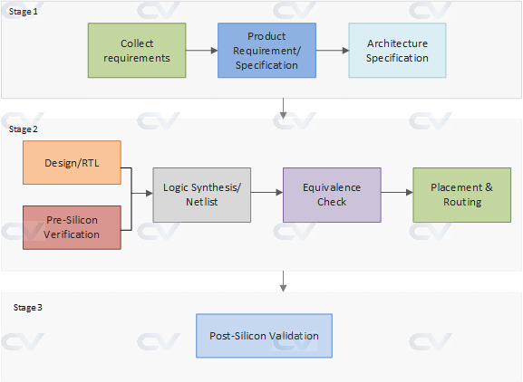
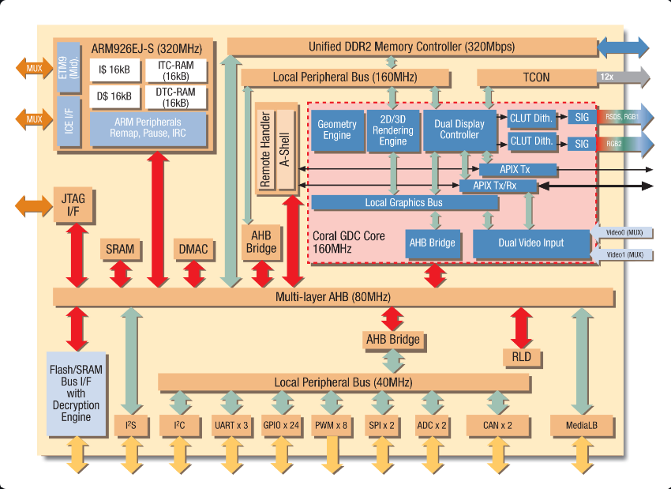

# ASIC Design Flow

## What is VLSI ?
VLSI stands for Very Large Scale Integration, which is a technology used to create integrated circuits (ICs) by combining thousands or millions of transistors into a single chip. VLSI technology has revolutionized the electronics industry by enabling the production of compact, powerful and low-cost microprocessors, memory chips, digital signal processors, and other advanced electronic devices.

As of 2020, the scale of integration in VLSI technology has reached nanometer-level processes, with feature sizes on the order of 7-5 nm, allowing for the integration of billions of transistors on a single chip. The latest processors and integrated circuits are being manufactured using 7 nm and 5 nm process nodes, enabling greater performance and power efficiency.

## What is an ASIC ?
An ASIC (Application-Specific Integrated Circuit) is a type of integrated circuit (IC) that is designed to perform a specific task or function. It is customized for a particular application, unlike general-purpose ICs such as microprocessors and memory chips.

ASICs are typically used in high-performance applications where specific processing requirements need to be met, such as in networking, telecommunications, and consumer electronics. ASICs are designed and manufactured for a specific customer or application and can include digital, analog, and mixed-signal components on a single chip.

## ASIC Design Flow
A typical design flow follows a structure shown below and can be broken down into multiple steps. Some of these phases happen in parallel and some sequentially. We'll take a look at how a typical project design cycle looks like in the industry today.

### Stage 1
1. Requirements
A customer of a semiconductor firm is typically some other company who plans to use the chip in their systems or end products. So, requirements of the customer also play an important role in deciding how the chip should be designed. Naturally, the first step would be to collect the requirements, estimate the market value of the end product, and evaluate the number of resources required to do the project.

2. Specifications
The next step would be to collect "specifications" that describe abstractly the functionality, interface and overall architecture of the chip to be designed. This can be something along the lines like :
- Requires computational power to run imaging algorithms to support virtual reality
- Requires two ARM A53 processors with coherent interconnect and should run at 600 MHz
- Requires USB 3.0, Bluetooth and PCIe 2nd gen interfaces
- Should support 1920x1080 pixel display with appropriate controller

3. Architecture
Now, the architects come up with a system level view of how the chip should operate. They will decide what all other components are required, what clock frequencies they should run, and how to target power and performance requirements. They also decide on how the data should flow inside the chip. An example would be the data flow when a processor fetches imaging data from the system ram and executes them. In the meanwhile, the graphics engine will execute post-processed data from the previous batch dumped into another part of memory and so on.

### Stage 2

