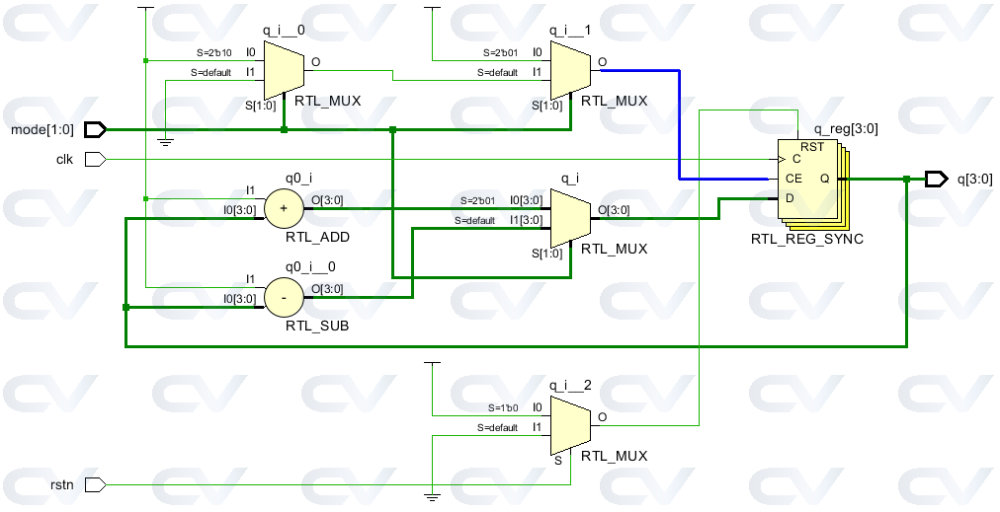
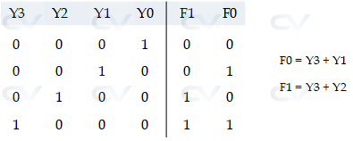

# Design Abstraction Layers

## Design Abstraction
Design abstraction layers refer to the different levels of detail at which a hardware system can be described. These layers facilitate the design process by allowing designers to focus on specific aspects of the system without getting bogged down by lower-level details.

1. Architecture Level
The top layer is the system level architecture that defines the various sub-blocks and groups them based on functionality.

For example, a processor cluster would have multiple cores, cache blocks, and cache coherence logic. All of this will be encapsulated and represented as a single block with input-output signals.

2. RTL Level
In the next level, each sub-block is written in a hardware description language to accurately describe the functionality of each individual blocks. Lower level implementation details like circuit schematics, technology libraries are ignored at this stage. For example, a controller block will end up having multiple Verilog files each describing a smaller component of its functionality.

```
module alu_32b (a, b, operation, result);
	input [31:0] 		a;
	input [31:0] 		b;
	input [1:0] 		operation;
	output reg [31:0] 	result;

	always@(a or b or operation) begin
		case (operation)
			2'b00:  result = a & b;   		// AND
			2'b01:  result = a  |   b;   	// OR
			2'b10:  result = a +  b;    	// Addition
			2'b11:  result = a - b;    		// Subtraction
		endcase
	end

endmodule
```

3. Schematic Level
HDLs are then converted to gate level schematics that also involve technology libraries that characterize digital elements like flip-flops. For example, the digital circuit for a D latch contains NAND gates arranged in a certain fashion such that all combinations of D and E inputs produce an output Q given by the truth table.



A truth table essentially gives permutation of all input signal levels and the resulting output level and the one given below is for a D latch with an enable pin. The hardware schematic can also be derived from the truth table using boolean logic and K-maps. However, it is not practical to follow this method for more complex digital blocks like processors and controllers.



4. Transistor Level
Implementation of a NAND gate is done by the connection of CMOS transistors in a particular format. At this level, the transistor channel widths, Vdd and the ability to drive the output capacitative load are taken into account during the design process.


5. Physical Level
The final step is the layout of these transistors in silicon using EDA tools so that it can be fabricated. At this level, some device and technology knowledge would be required because different layouts end up having different physical properties like resistance and capacitance among other implications.


## Design Styles
Next, there are primarily two styles followed in the design of digital blocks, which are top-down and bottom-up methodologies.

1. Top-Down
In this style, a top-level block is first defined along with the identification of sub-modules required to build the top block. Similarly, each of the sub-block is further divided into smaller components, and the process continues until we reach the leaf cell or a stage where it can't be further divided.

2. Bottom-up
In this case, the first task is to identify the available building blocks. Then they are put together and connected in a certain way to build bigger cells and used to piece together the top-level block.

Typically, a combination of both flows is used. Architects define the system level view of the design, and designers implement the logic of each of the functional blocks and get synthesized into gates. A top-down style is followed until this point.

However, these gates have been built following a bottom-up flow where starting with the physical layout of the smallest block in the best possible area, performance, and power. These standard cells also have a hardware schematic and can be used to obtain various information like rise and fall times, power, and other delays. These cells are made available to the synthesis tool which picks and instantiates them where required.
