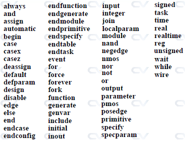

# What is Verilog ?

Verilog is a hardware description language (HDL) that is used to describe digital systems and circuits in the form of code. It was developed by Gateway Design Automation in the mid-1980s and later acquired by Cadence Design Systems.

Verilog is widely used for design and verification of digital and mixed-signal systems, including both application-specific integrated circuits (ASICs) and field-programmable gate arrays (FPGAs). It supports a range of levels of abstraction, from structural to behavioral, and is used for both simulation-based design and synthesis-based design.

The language is used to describe digital circuits hierarchically, starting with the most basic elements such as logic gates and flip-flops and building up to more complex functional blocks and systems. It also supports a range of modeling techniques, including gate-level, RTL-level, and behavioral-level modeling.

# Why Verilog useful ?

Verilog creates a level of abstraction that helps hide away the details of its implementation and technology.

For example, the design of a D flip-flop would require the knowledge of how the transistor need to be arranged to achive a positive-dege triggered FF and waht the rise, fall and clk-Q timesrequired to latch the value onto a flop among many other technology oriented details. Powr dissipation, timing and the ability to drive nets and other flops would also requrie a more through understading of the physical characteristics of a transistor.

Verilog helps us to focus on the behaviour and leave the rest to be sorted out later. 

# Verilog Code Example:
```verilog 
module ctr ( input up_down,
                   clk,
		           rstn,
             output reg [2:0] out);

always @ (posedge clk)
        if (!rstn)
            out << 0;
        else begin
            if (up_down)
	            out <= out + 1;
            else
                out <= out - 1;
        end
endmodule
```

The simple example shown above illustrates how all the physical implementation details (interconnection of underlying logic gates like NAND and NOR) have been hidden while still providing a clear idea of how the counter functions.

ctr is a module that represents an up/down counter, and it is possible to choose the actual physical implementation of the design from a wide variety of different styles of flops optimized for area, power and performance. They are usually compiled into libraries and will be available for us to select within EDA tools at a later stage in the design process.

# Verilog Hello World
It's always best to get started using a very simple example, and none serves the purpose best other than "Hello World !".


```verilog
// Single line comments start with double forward slash "//"
// Verilog code is always written inside modules, and each module represents a digital block with some functionality
module tb;

  // Initial block is another construct typically used to initialize signal nets and variables for simulation
	initial
		// Verilog supports displaying signal values to the screen so that designers can debug whats wrong with their circuit
		// For our purposes, we'll simply display "Hello World"
		$display ("Hello World !");
endmodule
```

A module called tb with no input-output ports act as the top module for the simulation. The initial block starts and executes the first statement at time 0 units. $display is a Verilog system task used to display a formatted string to the console and cannot be synthesized into hardware. Its primarily used to help with testbench and design debug. In this case, the text message displayed onto the screen is "Hello World !".

# Verilog Syntax
Lexical conventions in Verilog are similar to C in the sense that it contains a stream of tokens. A lexical token may consist of one or more characters and tokens can be comments, keywords, numbers, strings or white space. All lines should be terminated by a semi-colon ;.

## Comments
There are two ways to write comments in Verilog.

1. A single line comment starts with // and tells Verilog compiler to treat everything after this point to the end of the line as a comment.
2. A multiple-line comment starts with /* and ends with */ and cannot be nested.

However, single line comments can be nested in a multiple line comment.
```
// This is a single line comment

integer a;   // Creates an int variable called a, and treats everything to the right of // as a comment

/*
This is a
multiple-line or
block comment
*/

/* This is /*
an invalid nested
block comment */
*/

/* However,
// this one is okay
*/

// This is also okay
///////////// Still okay
```
## Whitespace
White space is a term used to represent the characters for spaces, tabs, newlines and formfeeds, and is usually ignored by Verilog except when it separates tokens. In fact, this helps in the indentation of code to make it easier to read. However blanks(spaces) and tabs (from TAB key) are not ignored in strings.

## Operators
There are three types of operators: unary, binary, and ternary or conditional.

1. Unary operators shall appear to the left of their operand.
2. Binary operators shall appear between their operands.
3. Conditional operators have two separate operators that separate three operands.
```
x = ~y;                // ~ is a unary operator, and y is the operand
x = y | z;             // | is a binary operator, where y and z are its operands
x = (y > 5) ? w : z;   // ?: is a ternary operator, and the expression (y>5), w and z are its operands

```
If the expression (y > 5) is true, then variable x will get the value in w, else the value in z.

## Number Format
We are most familiar with numbers being represented as decimals. However, numbers can also be represented in binary, octal and hexadecimal. By default, Verilog simulators treat numbers as decimals. In order to represent them in a different radix, certain rules have to be followed.
```
16          // Number 16 in decimal
0x10        // Number 16 in hexadecimal
10000       // Number 16 in binary
20          // Number 16 in octal
```
### Sized
Sized numbers are represented as shown below, where size is written only in decimal to specify the number of bits in the number.
```
[size]'[base_format][number]
```
1. base_format can be either decimal ('d or 'D), hexadecimal ('h or 'H) and octal ('o or 'O) and specifies what base the number part represents.
2. number is specified as consecutive digits from 0, 1, 2 ... 9 for decimal base format and 0, 1, 2 .. 9, A, B, C, D, E, F for hexadecimal.

```
3'b010;     // size is 3, base format is binary ('b), and the number is 010 (indicates value 2 in binary)
3'd2;       // size is 3, base format is decimal ('d) and the number is 2 (specified in decimals)
8'h70;      // size is 8, base format is hexadecimal ('h) and the number is 0x70 (in hex) to represent decimal 112
9'h1FA;     // size is 9, base format is hexadecimal ('h) and the number is 0x1FA (in hex) to represent decimal 506

4'hA = 4'd10 = 4'b1010 = 4'o12	// Decimal 10 can be represented in any of the four formats
8'd234 = 8'D234                 // Legal to use either lower case or upper case for base format
32'hFACE_47B2;                  // Underscore (_) can be used to separate 16 bit numbers for readability
```
Uppercase letters are legal for number specification when the base format is hexadecimal.

```
16'hcafe;         // lowercase letters Valid
16'hCAFE;         // uppercase letters Valid
32'h1D40_CAFE;    // underscore can be used as separator between 4 letters Valid
```

### Unsized
Numbers without a base_format specification are decimal numbers by default. Numbers without a size specification have a default number of bits depending on the type of simulator and machine.

```
-6'd3;            // 8-bit negative number stored as two's complement of 3
-6'sd9;           // For signed maths
8'd-4;            // Illegal
```

## Strings
A sequence of characters enclosed in a double quote " " is called a string. It cannot be split into multiple lines and every character in the string take 1-byte to be stored.

```
"Hello World!"        // String with 12 characters -> require 12 bytes
"x + z"               // String with 5 characters

"How are you
feeling today ?"      // Illegal for a string to be split into multiple lines
```

## Identifiers
Identifiers are names of variables so that they can be referenced later on. They are made up of alphanumeric characters [a-z][A-Z][0-9], underscores _ or dollar sign $ and are case sensitive. They cannot start with a digit or a dollar sign.

```
integer var_a;        // Identifier contains alphabets and underscore -> Valid
integer $var_a;       // Identifier starts with $ -> Invalid
integer v$ar_a;       // Identifier contains alphabets and $ -> Valid
integer 2var;         // Identifier starts with a digit -> Invalid
integer var23_g;      // Identifier contains alphanumeric characters and underscore -> Valid
integer 23;           // Identifier contains only numbers -> Invalid
```

## Keywords
Keywords are special identifiers reserved to define the language constructs and are in lower case. A list of important keywords is given below.


